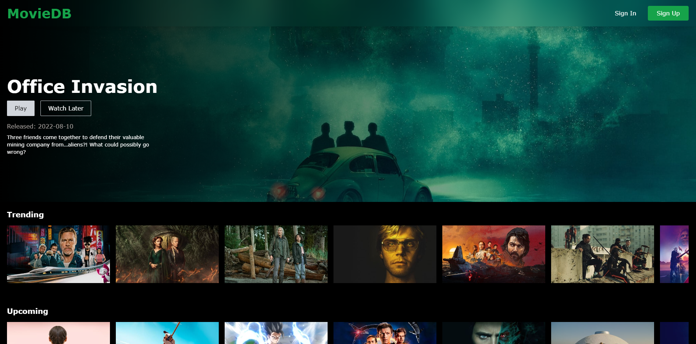
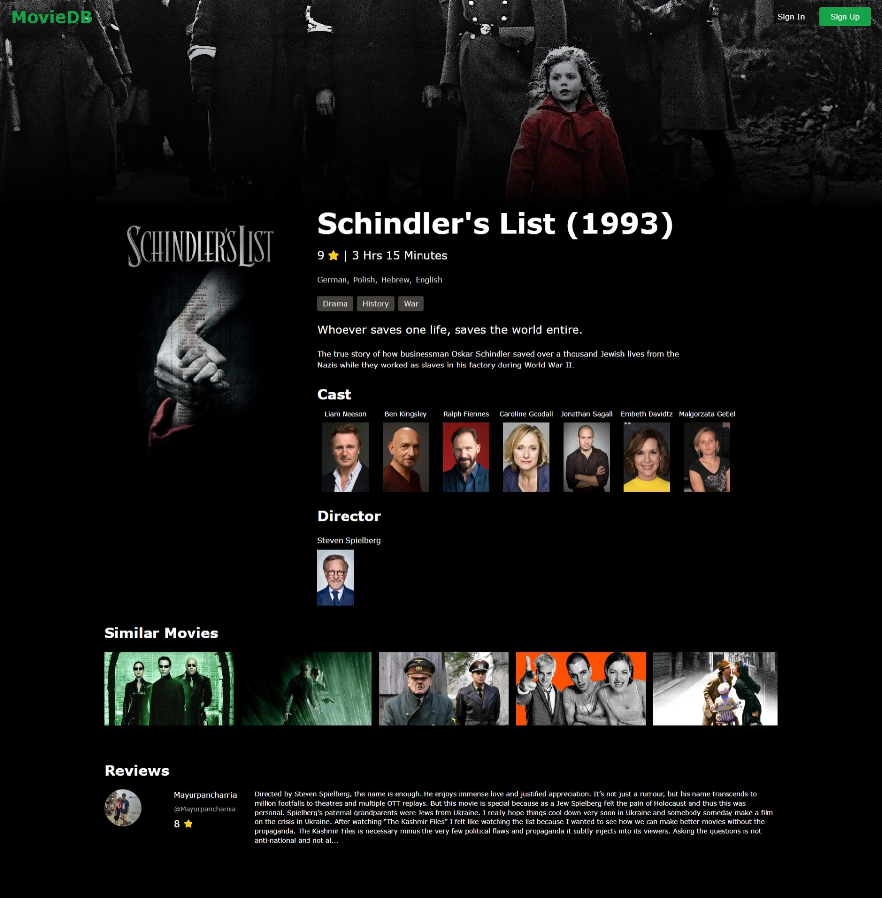
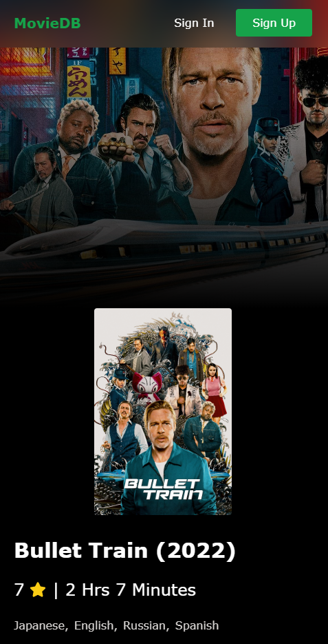
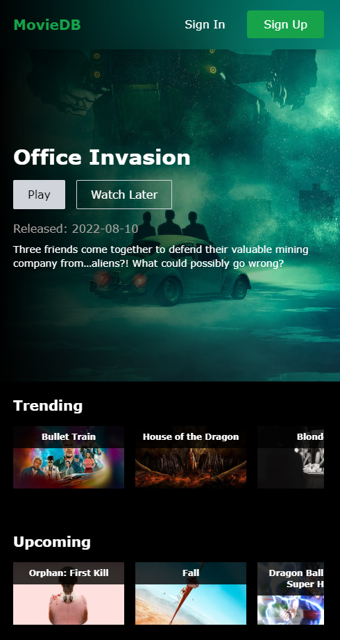

<h1 style="text-align: center;"><a href="https://movies-tv-db-react.web.app/">MovieDB</a> - Database for Movies</h1>

Find the latest, top-rated and genre based movies plus their ratings, cast and reviews - all in a single website.

- Made with [React](https://reactjs.org/), [Tailwind CSS](https://tailwindcss.com/) 
- Uses [Firebase](https://firebase.google.com/) authentication and hosted on Firebase platform

## Features (at a glance)

- Authentication
  - User can sign in and sign out
- Info of plethora of movies based on different categories.
- Upon clicking a movie, details are shown: -
  1. Name of movie
  2. Release year
  3. Rating
  4. Runtime
  5. Languages
  6. Genre
  7. Synopsis
  8. Cast
  9. Director
- Similar movies are also displayed on the screen in a form of a carousel (slider).
- User can read reviewes of the respective movies.

## Tech Used

## Dependencies

- Axios - to fetch API
- Tailwind CSS
- Tailwind Scrollbar Hide
- React Router
- React Router DOM
- Firebase - for authentication, deployment
- React icons
- Fontawesome icons

## Movie Details Page

This page displays the details of a movie such as
- A background poster
- Rating and runtime
- Languages and genre
- Synopsis or overview
- Cast and director
- Similar movies
- Reviews

### On larger screens:

### On mobile screens:

## Screenshots

MovieDB on mobile screens:

## Helpful Links

- [Hosted website](https://movies-tv-db-react.web.app/) (on Firebase)
- [How to deploy Firebase project?](https://dev.to/guillerbr/deploy-reactjs-on-firebase-hosting-4mpj)
- [TMDB Movies API](https://www.themoviedb.org/documentation/api)